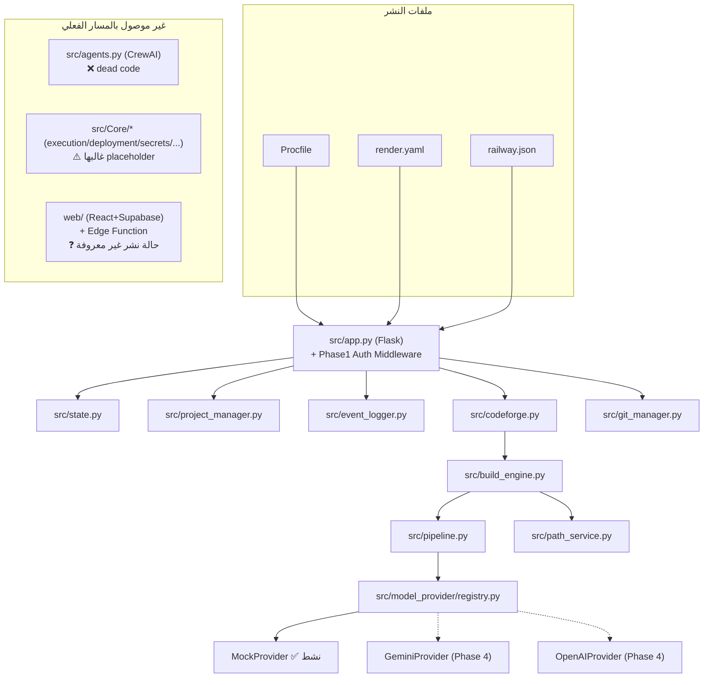

# ARCHITECTURE.md — الحالة الفعلية المُتحقَّقة (Phase 2)

> هذا المستند يعكس **ما يعمل فعلياً** بدليل مباشر (تتبع استيراد + اختبار تشغيل)، وليس النية الأصلية. للقرار الرسمي انظر `docs/adr/012-canonical-architecture.md`. للتفاصيل الجنائية الكاملة انظر `AUDIT_REPORT.md`.

## مخطط النظام (Production Path فقط)

## تصنيف المكوّنات
انظر الجدول الكامل في `docs/adr/012-canonical-architecture.md`.

## حقيقة المزوّدين (Providers) حالياً
- **Mock**: الوحيد النشط فعلياً في أي بيئة نشر حالية بلا تدخل إضافي.
- **Gemini / OpenAI**: طبقة الواجهة (`registry.py`) موجودة، **لكن ملفات التنفيذ الفعلية أُضيفت في Phase 4** (انظر `PHASE4_PROVIDERS.md`).

## حقيقة الأمان
طبقة Default-Deny على `/api/*` (باستثناء `GET /api/health`) — انظر `docs/adr/` والكود في `src/app.py`. التفاصيل والتحقق في `tests/test_security.py` و`FINAL_VERIFICATION.md`.

## ما لا يعكسه هذا المخطط (قصداً)
- `web/` غير مرسومة كمسار تشغيل حقيقي لأن **حالة نشرها الفعلية غير قابلة للتحقق من هذه البيئة (UNKNOWN)** — رسمها كمسار "يعمل" سيكون ادعاءً غير موثَّق.
- بيئات Replit/Docker/Railway الفعلية: حالة كل منها موثقة في `FINAL_VERIFICATION.md` (§Environment Matrix) وليس هنا، لأن هذا الملف عن البنية لا عن حالة التشغيل الخارجي.
