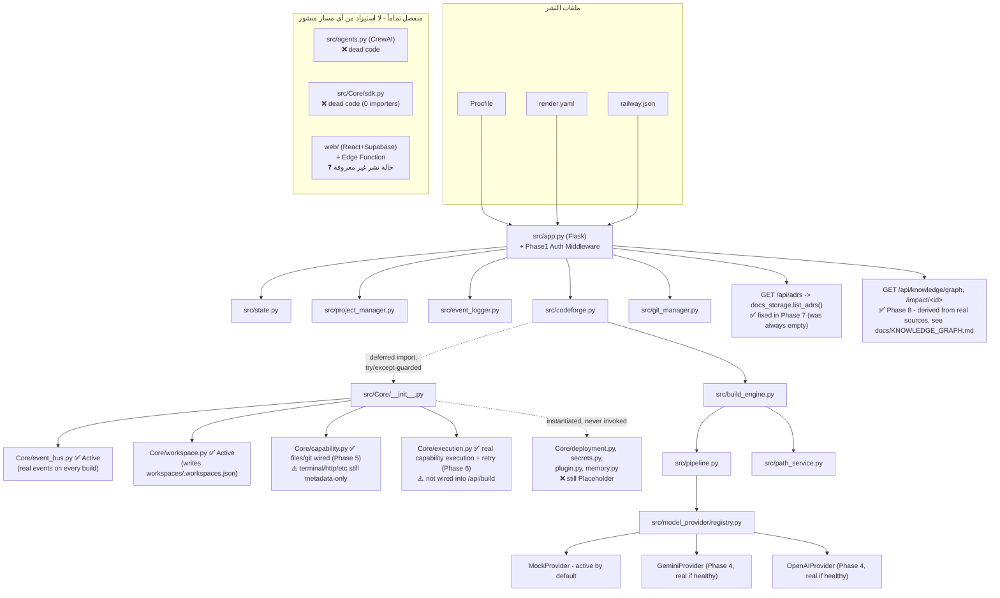

# ARCHITECTURE.md — الحالة الفعلية المُتحقَّقة (محدَّث حتى Phase 8)

> هذا المستند يعكس **ما يعمل فعلياً** بدليل مباشر (تتبع استيراد + اختبار تشغيل)، وليس النية الأصلية. للقرار الرسمي انظر `docs/adr/012-canonical-architecture.md`. للتفاصيل الجنائية الكاملة انظر `AUDIT_REPORT.md`. لسجل التغييرات الكامل انظر `CHANGELOG.md`.

## مخطط النظام (Production Path فقط)

## تصنيف المكوّنات
انظر التصنيف الدقيق (لكل ملف على حدة، بالدليل) في `docs/adr/013-src-core-architectural-status.md`. القرار العلوي التلخيصي في `docs/adr/012-canonical-architecture.md` (مع تصحيح Errata في نهايته). **ملاحظة**: `capability.py` و`execution.py` تغيّر تصنيفهما جزئياً بعد Phase 5/6 (files/git أصبحا Active فعلياً) - الجدول في ADR-013 يعكس الحالة *قبل* Phase 5؛ `CHANGELOG.md` يوثّق كل تغيير لاحق بدليله.

## حقيقة المزوّدين (Providers) حالياً
- **Mock**: نشط افتراضياً ما لم يُضبَط مزوّد حقيقي وسليم.
- **Gemini / OpenAI**: مُنفَّذان فعلياً (Phase 4) - انظر `CHANGELOG.md` §Phase 4 وقيد الاتصال الحي الصادق المذكور فيه.

## حقيقة الأمان
طبقة Default-Deny على `/api/*` (باستثناء `GET /api/health`) — التفاصيل الكاملة في `docs/API.md`، والتحقق في `tests/test_security.py`.

## ما لا يعكسه هذا المخطط (قصداً)
- `web/` غير مرسومة كمسار تشغيل حقيقي لأن **حالة نشرها الفعلية غير قابلة للتحقق من هذه البيئة (UNKNOWN)** — رسمها كمسار "يعمل" سيكون ادعاءً غير موثَّق.
- بيئات Replit/Docker/Railway الفعلية: لا يوجد تحقق تشغيلي حي منها من بيئة العمل المستخدَمة طوال هذه المهمة (UNKNOWN بصراحة، غير مُدَّعاة أبداً كـ PASS).
