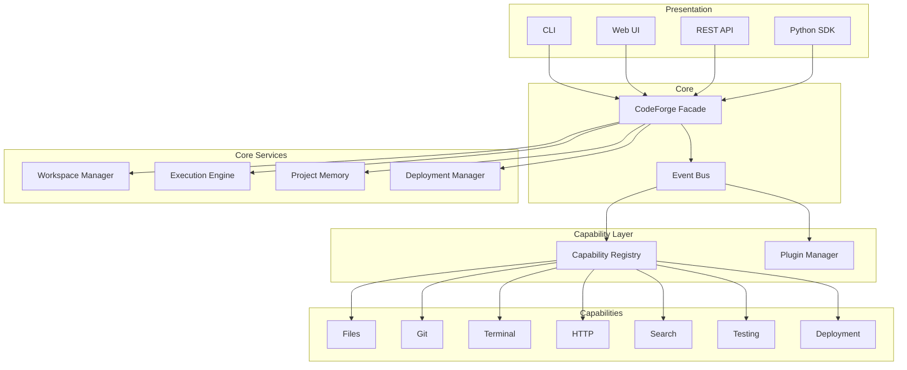

# ADR-011: CodeForge X - Capability Architecture

## الحالة
**مقبول** - 2026-07-17

---

## المشكلة

تحويل CodeForge من أداة تجريبية إلى مصنع برمجيات ذاتي (Autonomous Software Factory).

---

## السياق

CodeForge v1.0 يوفر:
- Build Engine بسيط
- Pipeline للمهام
- Storage Layer
- Event Logger

لكن:
- الوكلاء مرتبطون مباشرة بالـ Core
- لا يوجد نظام Plugin
- لا يوجد Event Bus
- لا يوجد نظام Capabilities

---

## القرارات

### 1. CodeForge X Core (5 طبقات)

```
Core/
├── Workspace Manager     # إدارة المشاريع والملفات
├── Capability System     # سجل القدرات + Plugin System
├── Execution Engine      # محرك التنفيذ
├── Project Memory        # ذاكرة لكل مشروع
└── Deployment Manager    # إدارة النشر
```

### 2. Event Bus

```python
EventType = {
    PROJECT_CREATED,
    TASK_STARTED,
    BUILD_SUCCEEDED,
    BUILD_FAILED,
    DEPLOYMENT_STARTED,
    CAPABILITY_REGISTERED,
    PLUGIN_LOADED,
    # ...
}
```

### 3. Capability System

```python
@dataclass
class Capability:
    name: str
    description: str
    permissions: List[Permission]
    tools: Dict[str, Tool]
```

### 4. Plugin System

```
plugins/
└── my-plugin/
    ├── manifest.json
    ├── __init__.py
    └── capabilities/
```

---

## المعمارية الجديدة



---

## التنفيذ

### الملفات الجديدة

| الملف | الوصف |
|-------|-------|
| `src/Core/__init__.py` | Core exports |
| `src/Core/event_bus.py` | Event Bus |
| `src/Core/capability.py` | Capability System |
| `src/Core/plugin.py` | Plugin System |
| `src/Core/workspace.py` | Workspace Manager |
| `src/Core/execution.py` | Execution Engine |
| `src/Core/memory.py` | Project Memory |
| `src/Core/secrets.py` | Secrets Manager |
| `src/Core/deployment.py` | Deployment Manager |
| `src/Core/sdk.py` | Python SDK |

### التوافق مع v1

- v1 تظل تعمل
- CodeForge X يُحمّل تدريجياً
- Core اختياري (try/except)

---

## النتائج

### إيجابية
- Architecture قابلة للتوسع
- Plugin System للـ 3rd party
- Event Bus للـ loose coupling
- Capability System مرن

### سلبية
- تعقيد أعلى
- منحنى تعلم أكبر

---

## ملاحظات

- **Migration**: تدريجي
- **Testing**: قبل/بعد
- **Documentation**: هذا ADR
