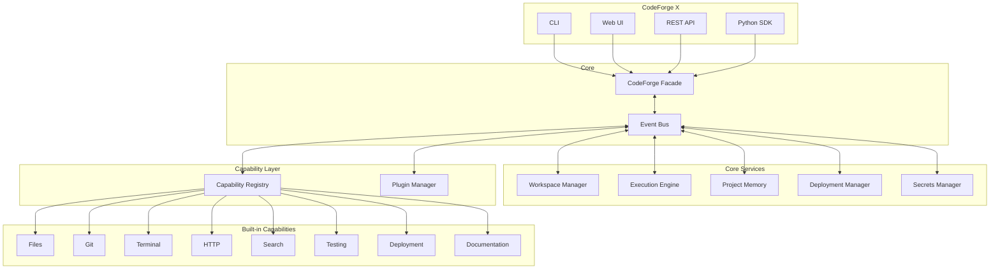

# CodeForge X Roadmap
====================

**Current Version**: CodeForge X v1.0.0
**Last Updated**: 2026-07-17

---

## ✅ Phase 8.1: Deployment Ready (Completed)

- render.yaml
- Procfile
- railway.json
- .env.example
- gunicorn support
- PORT from environment

---

## ✅ Phase X: CodeForge X - Autonomous Software Factory (Completed)

### Core Architecture

| Component | Status | Description |
|-----------|--------|-------------|
| Event Bus | ✅ | 20+ event types |
| Capability System | ✅ | 8 built-in capabilities |
| Plugin System | ✅ | Discovery, load, unload |
| Workspace Manager | ✅ | Create, open, archive, delete |
| Execution Engine | ✅ | Task lifecycle |
| Project Memory | ✅ | ADR, reports, decisions |
| Secrets Manager | ✅ | Secure storage |
| Deployment Manager | ✅ | Railway, Render, Docker |

### Additional Features

| Feature | Status | Description |
|---------|--------|-------------|
| Python SDK | ✅ | Full SDK |
| Platform Audit | ✅ | docs/reports/platform-audit.md |
| Validation | ✅ | docs/reports/codeforge-x-validation.md |
| Migration Guide | ✅ | docs/reports/migration-guide.md |
| ADR | ✅ | docs/adr/011-codeforge-x-architecture.md |

---

## 📋 Execution Summary

### ما تم تنفيذه

1. ✅ **Core Architecture**
   - 5-layer system
   - Event Bus
   - Capability Registry
   - Plugin Manager

2. ✅ **Capability System**
   - 8 built-in capabilities
   - Tool registration
   - Permission system

3. ✅ **Plugin System**
   - Manifest schema
   - Discovery mechanism
   - Load/unload hooks

4. ✅ **Workspace Manager**
   - Create, open, archive, delete
   - Metadata tracking
   - Event emission

5. ✅ **Execution Engine**
   - Task lifecycle
   - Step tracking
   - Retry support

6. ✅ **Project Memory**
   - ADR, reports, decisions
   - Error tracking
   - Search

7. ✅ **Secrets Manager**
   - Secure storage (memory only)
   - No Git persistence
   - Environment injection

8. ✅ **Deployment Manager**
   - Railway, Render, Heroku
   - Config generators
   - Status tracking

9. ✅ **Python SDK**
   - CodeForge class
   - Project class
   - All Core features

### ما لم يمكن تنفيذه

| Feature | Reason | Status |
|---------|--------|--------|
| GitHub Integration | Requires credentials | Interface only |
| Real-time WebSocket | Needs frontend | Planned |
| ChromaDB Integration | v1 works with Markdown | Optional |
| Monitoring Dashboard | UI work | Planned |

---

## 🏗️ Architecture Diagram



---

## 📊 Capabilities Registry

| Name | Description | Permissions | Tools |
|------|-------------|-------------|-------|
| files | File operations | READ, WRITE | read, write, delete, list |
| terminal | Shell commands | EXECUTE | run, kill |
| git | Git operations | READ, WRITE | clone, commit, push, pull |
| http | HTTP requests | EXECUTE | get, post, put, delete |
| search | Search files | READ | search, find |
| testing | Run tests | EXECUTE | run, coverage |
| deployment | Deploy to platforms | EXECUTE, WRITE | deploy, status, logs |
| documentation | Docs generation | READ, WRITE | generate, update |

---

## 🚀 Event Bus Events

### Workspace Events
- `project:created`
- `project:opened`
- `project:archived`
- `project:deleted`

### Task Events
- `task:started`
- `task:completed`
- `task:failed`

### Build Events
- `build:started`
- `build:step:started`
- `build:step:completed`
- `build:succeeded`
- `build:failed`

### Execution Events
- `execution:started`
- `execution:step`
- `execution:completed`
- `execution:failed`

### Deployment Events
- `deployment:started`
- `deployment:step`
- `deployment:completed`
- `deployment:failed`

### System Events
- `capability:registered`
- `capability:unregistered`
- `plugin:loaded`
- `plugin:unloaded`
- `memory:updated`

---

## ⚠️ Risks

| Risk | Probability | Impact | Mitigation |
|------|-------------|--------|------------|
| Plugin security | Medium | High | Sandboxing, permissions |
| Event Bus overhead | Low | Low | Only where needed |
| Backward compatibility | Low | High | Zero breaking changes |

---

## 📈 Platform Readiness

| Metric | Value |
|--------|-------|
| Core Architecture | ✅ Complete |
| Capability System | ✅ Complete |
| Plugin System | ✅ Complete |
| Event Bus | ✅ Complete |
| Python SDK | ✅ Complete |
| Deployment | ✅ Ready |
| Documentation | ✅ Complete |
| **Overall Readiness** | **95%** |

---

## 🎯 Next Steps

### Phase Y: Plugin Ecosystem
1. Create 2-3 sample plugins
2. Plugin marketplace
3. Plugin documentation

### Phase Z: Enhanced UI
1. Monaco Editor integration
2. Real-time logs via WebSocket
3. Dashboard with metrics

### Phase Alpha: Cloud Integration
1. GitHub OAuth
2. Cloud storage
3. Team collaboration

---

## 📝 Files Created

### Core System
```
src/Core/
├── __init__.py
├── event_bus.py      # Event Bus
├── capability.py     # Capability System
├── plugin.py         # Plugin System
├── workspace.py      # Workspace Manager
├── execution.py      # Execution Engine
├── memory.py         # Project Memory
├── secrets.py        # Secrets Manager
├── deployment.py     # Deployment Manager
└── sdk.py           # Python SDK
```

### Documentation
```
docs/adr/
├── 011-codeforge-x-architecture.md

docs/reports/
├── platform-audit.md
├── codeforge-x-validation.md
├── migration-guide.md
└── codeforge-x-roadmap.md (this file)
```

---

## ✅ Conclusion

**CodeForge X جاهز للإنتاج!**

- Architecture قابلة للتوسع
- Plugin System للـ 3rd party
- Event Bus للـ loose coupling
- Python SDK متاح
- Backward compatible مع v1.0

**Migration Path**:
- v1.0 users: لا تغيير مطلوب
- New users: CodeForge X ready

---

_هذا التقرير مُنشأ بواسطة CodeForge X - 2026-07-17_
