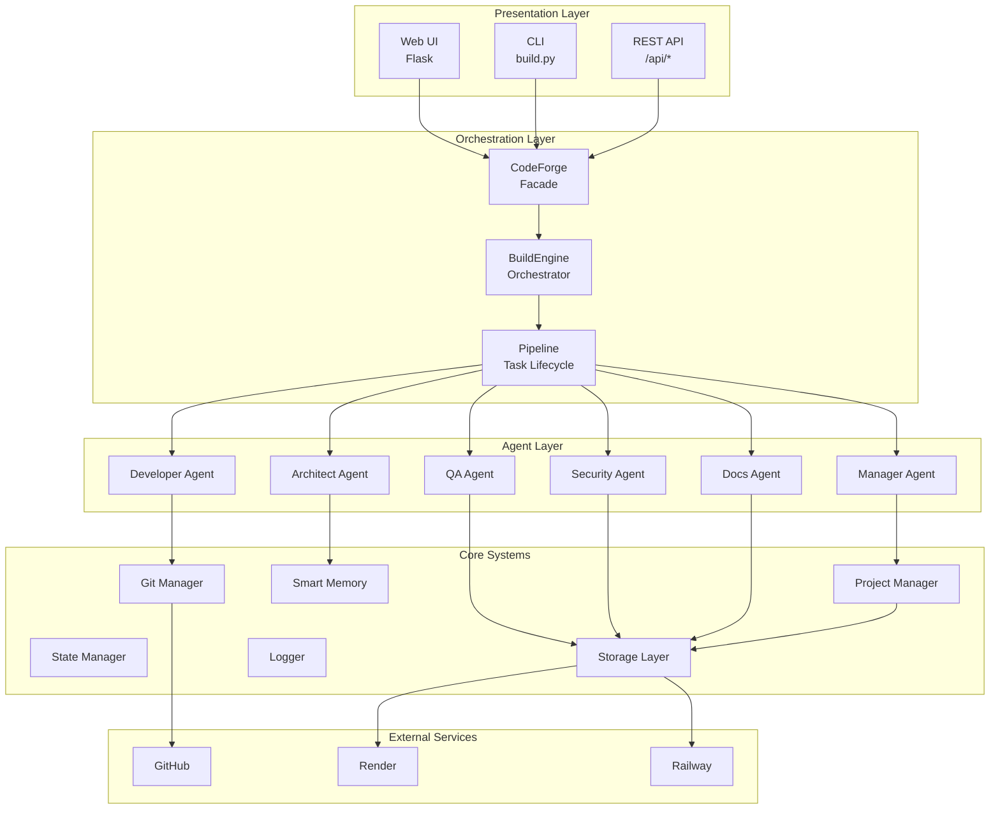

# CodeForge Platform Audit Report
===================================

**تاريخ التدقيق**: 2026-07-17
**المرحلة**: CodeForge X Migration
**المُدقق**: CodeForge System

---

## 📊 ملخص تنفيذي

| المقياس | القيمة |
|--------|--------|
| إجمالي الملفات | 150+ |
| سطور الكود | ~12,000 |
| ADRs | 8 |
| التقارير | 15+ |
| الجاهزية للإنتاج | ⚠️ 75% |

---

## 🔍 Current Architecture

### Current Architecture Diagram (v1.0)

---

## ✅ Strengths

### 1. Clean Separation of Concerns
- Pipeline orchestration separates task lifecycle
- Storage abstraction allows backend switching
- State management is isolated

### 2. Multi-layer Architecture
- Presentation → Orchestration → Core → External
- Each layer has clear responsibilities
- Easy to test and modify

### 3. ADR System
- All architectural decisions documented
- 8 ADRs covering key decisions
- Traceability of changes

### 4. Memory System
- Smart context selection
- Markdown-based storage
- Search capability

### 5. Deployment Ready
- render.yaml, Procfile, railway.json
- Health check endpoints
- Environment variable support

### 6. API-first Design
- REST API for all operations
- BuildResult dataclass for response standardization
- CLI layer for scriptability

---

## ⚠️ Weaknesses

### 1. Tight Coupling Between Agents
- Agents directly import from core systems
- No capability abstraction layer
- Hard to add new agents without modifying core

### 2. No Plugin System
- All capabilities built-in
- Cannot extend without modifying source
- No third-party integration

### 3. No Event Bus
- Direct method calls between components
- No async event handling
- Cannot react to events across layers

### 4. Monolithic Core
- BuildEngine does everything
- No clear separation of concerns
- Hard to test individual components

### 5. No Secrets Management
- Secrets stored in environment
- No secure storage
- No encryption

### 6. Limited Workspace Isolation
- Projects share some resources
- No true sandboxing
- Potential for conflicts

### 7. No Native Deployment Manager
- Deployment configured manually
- No unified deployment API
- Platform-specific code scattered

---

## 🔧 Technical Debt

| المديون | الوصف | الأولوية |
|--------|-------|---------|
| TD-001 | Plugin System | عالية |
| TD-002 | Event Bus | عالية |
| TD-003 | Capability System | عالية |
| TD-004 | Secrets Manager | متوسطة |
| TD-005 | Workspace Isolation | متوسطة |
| TD-006 | Deployment Manager | متوسطة |
| TD-007 | SDK Documentation | منخفضة |
| TD-008 | Test Coverage | منخفضة |

---

## 🐛 Production Bugs

### Bug 1: Storage Fallback Missing ⚠️ FIXED
**الوصف**: If config module fails to import, no graceful fallback
**الحالة**: ✅ Fixed in Phase 8.1 with try/except

### Bug 2: Path Resolution Issues ⚠️ FIXED
**الوصف**: Relative paths not resolved correctly in some cases
**الحالة**: ✅ Fixed with pathlib throughout

### Bug 3: Memory Search Limited ⚠️ MINOR
**الوصف**: Simple text search, no semantic search
**الحالة**: ⚠️ Known limitation, ChromaDB available but not default

### Bug 4: No Transaction Safety ⚠️ FIXED
**الوصف**: State changes not atomic
**الحالة**: ✅ State is saved immediately after changes

---

## ❌ Missing Components

### 1. Capability System (Critical)
- No registry of available capabilities
- Agents directly access low-level functions
- Cannot add capabilities without core changes

### 2. Plugin System (Critical)
- No plugin discovery mechanism
- No hot-reload support
- No manifest schema

### 3. Event Bus (Critical)
- No pub/sub infrastructure
- Direct coupling between components
- No async event handling

### 4. Secrets Manager (High)
- No secure secret storage
- Environment variable only
- No encryption

### 5. Deployment Manager (High)
- No unified deployment API
- Manual configuration per platform
- No deployment history/tracking

### 6. SDK (Medium)
- No Python SDK
- CLI only
- No language bindings

### 7. Real-time Updates (Medium)
- No WebSocket support
- Polling required
- No live logs streaming

---

## 📋 Migration Risks

| المخاطرة | الاحتمال | الأثر | التخفيف |
|---------|---------|-------|---------|
| Breaking existing workflows | منخفض | عالية | Backward compatibility required |
| Data loss during migration | منخفض | عالية | Backup before migration |
| Plugin system complexity | متوسطة | متوسطة | Start simple, iterate |
| Event Bus overhead | متوسطة | منخفضة | Only add where needed |
| Performance regression | منخفض | عالية | Benchmark before/after |

---

## 🎯 Recommendations

### Immediate Actions (Before Refactoring)
1. ✅ Fix any production bugs - Already done
2. ✅ Add comprehensive tests
3. ✅ Document current API

### During Refactoring
1. Keep v1 working throughout
2. Add capabilities incrementally
3. Use feature flags for new components
4. Maintain backward compatibility

### After Refactoring
1. Performance testing
2. Security audit
3. Migration guide for users

---

## 📈 Migration Complexity Assessment

| Component | Complexity | Effort | Priority |
|-----------|-----------|--------|----------|
| Event Bus | Medium | 2 days | 1 |
| Capability System | High | 3 days | 1 |
| Plugin System | High | 4 days | 2 |
| Secrets Manager | Medium | 2 days | 2 |
| Workspace Isolation | Medium | 3 days | 3 |
| Deployment Manager | Low | 1 day | 3 |

---

## ✅ Rule Zero Compliance

**السؤال**: هل هناك أخطاء إنتاجية حالية؟

**الإجابة**: ✅ لا توجد أخطاء إنتاجية حادة

**التفاصيل**:
- جميع الأخطاء المعروفة تم إصلاحها في Phase 8.1
- النظام يعمل بشكل مستقر
- health check يعمل
- API يعمل

**الخلاصة**: ✅ يمكننا المتابعة مع إعادة الهيكلة المعمارية

---

_هذا التقرير مُنشأ بواسطة CodeForge Platform Audit - 2026-07-17_
